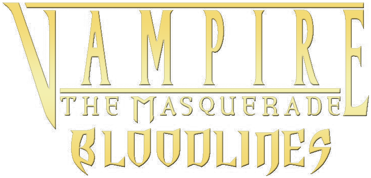

# Vampire: The Masquerade Bloodlines RTX Remix (WIP)

A project to add RTX Remix for Vampire: The Masquerade Bloodlines.

## Introduction

The intention of this project is to bring you Vampire: The Masquerade Bloodlines how we believe Troika games intended the game to look. With realistic lighting, reflections, darkness and all new textures.

All textures and assets will be hand authored, **no AI generated assets** will be part of the final mod. While we create these assets these will be our interpretation, without straying too much to what we believe was what it should have looked like. Support for now is Unofficial Patch only.

## Setup:

Preparing the game:

1. Install [Unofficial Patch](https://www.moddb.com/mods/vtmb-unofficial-patch/downloads) (without Plus Patch)

Install RTX Remix:

Download [RTX Remix](https://www.nvidia.com/en-gb/geforce/rtx-remix/).
The installation process involves installing Nvidia's omniverse. Once it is installed the RTX Remix extension can be installed.

Enabling RTX Remix Runtime:

1. Paste Remix Runtime in the main folder next to the game's executable (**not** inside the Bin folder)
   - Copy from: `C:\Users\"Your User"\AppData\Local\ov\pkg\rtx-remix-2024.1.1\deps\r emix_runtime\runtime` or [rtx-remix releases](https://github.com/NVIDIAGameWorks/rtx-remix/releases) (0.4.1 seems to cause some issues with captures so go for 0.4.0 for now)
2. Set launch args to `-game Unofficial_Patch -dxlevel 70 +mat_dxlevel 70  +r_novis 1 +r_frustumcullworld 0 +c_frustumcull 0 +r_occlusion 0 +r_shadows 0 +mat_queue_mode 0 +r_unloadlightmaps 1 +mat_drawwater 0 -novid -window` [(More about args here)](https://github.com/CattoSalad/VTMB-RTX-Remix/wiki/Launch-Args)
3. Drop [`rtx.conf`](https://raw.githubusercontent.com/CattoSalad/VTMB-RTX-Remix/main/rtx.conf) in the main directory to import the settings.

### What can I expect from this configuration?

As of right now the game is playable, allowing you to capture scenes, replace assets and add lights. There are some visual glitches such as tall buildings not showing up properly and sky boxes not being rendered correctly. Other issues include TVs, there isn't currently support for multiple cameras meaning TVs don't work ingame.

### Progress:

A demo of the first Haven is being prepared as a demo of what we intend to achieve with this project.

- [Maps status](https://docs.google.com/spreadsheets/d/1YT8pDlQ9t2QfCrWI-bpDiXkVMTRCeSeuKXfKRx9q8Vc/edit?usp=drive_link)

- [Materials status](https://docs.google.com/spreadsheets/d/1m0PmmWQZsil5DT6Q3EL437tDnqPiFBxCXPbf6PHIpB0/edit?usp=drive_link)

- [Model status](https://docs.google.com/spreadsheets/d/1PgCTIqSVg_mVAJs04IKayr8BnIdhFkiBNqFP85U95C8/edit?usp=drive_link)

## Captures

Captures are located under [`/rtx-remix/captures`](https://github.com/CattoSalad/VTMB-RTX-Remix/tree/main/rtx-remix/captures) folder. Feel free to download and use those with [RTX Remix](https://www.nvidia.com/en-gb/geforce/rtx-remix/https://www.nvidia.com/en-gb/geforce/rtx-remix/).

## Known Issues:

- [ ] Ghost buildings - Some buildings are transparent and a lot of roofs are also affected.
- [ ] The sky is broken - The sky is a bit strange now. Hopefully categorising some textures should help this. Some different launch arguments may be required.
- [x] Invisible cars - Not present with plus patch, but seems to be an issues through Unofficial Patch 11.1 - 11.5. Investigating which version would best suit using the rtx remix. [Temporary Solution](https://github.com/CattoSalad/VTMB-RTX-Remix/issues/1) - Should be fixed on the latest version of Unofficial Patch 11.5+.
- [x] Some textures can become invisible when moving around - We believe it's caused by culling settings, some engine tweaks may be required to fix this issue. - Solved with extra launch args.
